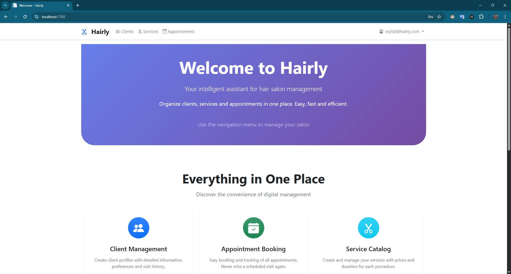
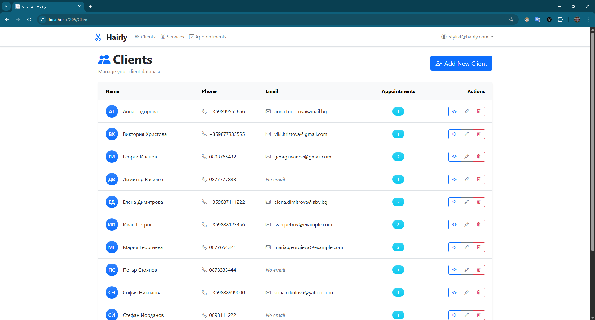
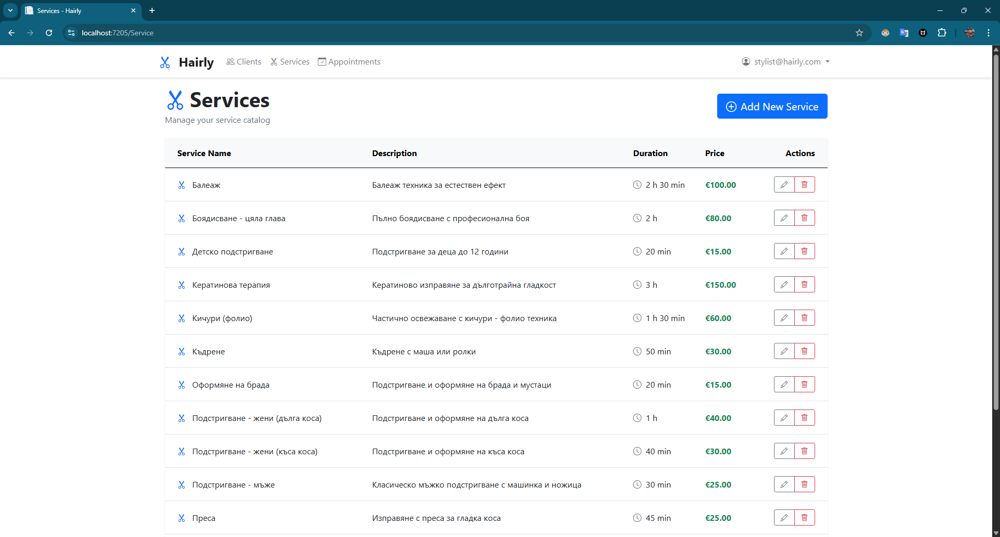
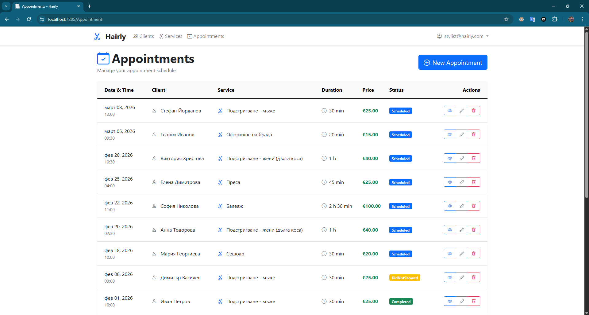

# 💈 Hairly Web App

> A web application for hairdressers to manage clients, services, and appointments


---

## 📋 Table of Contents

- [About the Project](#about-the-project)
- [Features](#features)
- [Screenshots](#screenshots)
- [Technologies Used](#technologies-used)
- [Prerequisites](#prerequisites)
- [Installation & Setup](#installation--setup)
  - [Windows Setup](#windows-setup)
  - [macOS Setup](#macos-setup)
- [Database Configuration](#database-configuration)
- [Running the Application](#running-the-application)
- [Default Login](#default-login)
- [Project Structure](#project-structure)
- [How to Use](#how-to-use)
- [Troubleshooting](#troubleshooting)
- [License](#license)
- [Contact](#contact)

---

## 📖 About the Project

**Hairly** is a web application that helps hairdressers manage their daily work. The system allows you to:
- Keep track of your clients
- Manage your services (haircuts, coloring, etc.)
- Schedule and manage appointments

This project was built for the **ASP.NET Fundamentals** course at SoftUni. It shows how to build a real web application using ASP.NET Core MVC, Entity Framework, and SQL Server.
Probably it will be extended in the Advanced course.

---

## ✨ Features

### Client Management
- ✅ Add, edit, view, and delete clients
- ✅ Store client details (name, phone, email, notes)
- ✅ See appointment history for each client

### Service Catalog
- ✅ Add and manage your services
- ✅ Set prices and duration for each service
- ✅ See how many active appointments use each service

### Appointment Scheduling
- ✅ Create appointments with client and service
- ✅ Edit appointments and change status
- ✅ Track appointment statuses (Scheduled, Completed, Canceled, Did Not Show)
- ✅ View all appointment details
- ✅ Today's appointments are highlighted

### Security
- ✅ Login required to use the app
- ✅ Each hairdresser sees only their own data
- ✅ Deleted items can be recovered (soft delete)

---

## 📸 Screenshots

### Main Page
> *Screenshot of the home page will go here*



### Client Management
> *Screenshot of the clients list*



### Service Management
> *Screenshot of the services list*



### Appointment Scheduling
> *Screenshot of the appointments page*



---

## 🛠️ Technologies Used

| Technology | Version | Purpose |
|-----------|---------|---------|
| ASP.NET Core MVC | 8.0 | Web framework |
| Entity Framework Core | 8.0 | Database access |
| SQL Server LocalDB (Windows) | - | Development database |
| SQL Server (Docker on macOS) | - | Development database |
| ASP.NET Identity | 8.0 | User login and security |
| Bootstrap | 5.3 | Responsive design |
| jQuery | 3.7 | Form validation |
| C# | 12.0 | Programming language |

---

## ✅ Prerequisites

### For Windows:

- **[.NET SDK 8.0+](https://dotnet.microsoft.com/download)**
- **[Visual Studio 2022](https://visualstudio.microsoft.com/)** (recommended) or **[Visual Studio Code](https://code.visualstudio.com/)**
- **[SQL Server LocalDB](https://learn.microsoft.com/en-us/sql/database-engine/configure-windows/sql-server-express-localdb)** (comes with Visual Studio)
- **[Git](https://git-scm.com/)** (optional)

### For macOS:

- **[.NET SDK 8.0+](https://dotnet.microsoft.com/download)**
- **[Visual Studio Code](https://code.visualstudio.com/)**
- **[Docker Desktop](https://www.docker.com/products/docker-desktop/)** (for SQL Server)
- **[Git](https://git-scm.com/)** (optional)

### Verify Installation

Check if .NET SDK is installed:
```bash
dotnet --version
# Should show: 8.0.x or higher
```

---

## 🚀 Installation & Setup

### Step 1: Get the Project

**Option A: Using Git**
```bash
git clone https://github.com/DjankoWE/Hairly-Web-App.git
cd Hairly-Web-App
```

**Option B: Download ZIP**
- Download the ZIP file from GitHub
- Extract to your desired folder
- Open terminal/command prompt in that folder

### Step 2: Install Dependencies

```bash
cd Hairly-Web-App
dotnet restore
```

This downloads all required packages.

---

## 🪟 Windows Setup

### 1. Check SQL Server LocalDB

SQL Server LocalDB should already be installed if you have Visual Studio. To verify:

```bash
sqllocaldb info
```

If not installed, download it from [Microsoft's website](https://learn.microsoft.com/en-us/sql/database-engine/configure-windows/sql-server-express-localdb).

### 2. Apply Database Migrations

```bash
cd Hairly.Web
dotnet ef database update
```

✅ This creates the database and adds test data (clients, services, appointments).

### 3. Run the Application

**Option A: Visual Studio**
1. Open `Hairly-Web-App.sln`
2. Press `F5` or click the green play button

**Option B: Command Line**
```bash
cd Hairly.Web
dotnet run
```

The app will open at `https://localhost:7205`

---

## 🍎 macOS Setup

### 1. Install and Start SQL Server with Docker

Since macOS doesn't have SQL Server LocalDB, we'll use Docker:

**Install Docker Desktop:**
- Download from [docker.com](https://www.docker.com/products/docker-desktop/)
- Install and start Docker Desktop

**Start SQL Server container:**
```bash
docker run -e "ACCEPT_EULA=Y" -e "MSSQL_SA_PASSWORD=YourStrong@Password123" \
   -p 1433:1433 --name sqlserver --hostname sqlserver \
   -d mcr.microsoft.com/mssql/server:2022-latest
```

**Verify SQL Server is running:**
```bash
docker ps
# Should show the sqlserver container running
```

### 2. Update Connection String for macOS

Edit `Hairly.Web/appsettings.Development.json`:

**Change from:**
```json
"Server=(localdb)\\mssqllocaldb;Database=HairlyDB;..."
```

**To:**
```json
"Server=localhost,1433;Database=HairlyDB;User Id=sa;Password=YourStrong@Password123;TrustServerCertificate=True;MultipleActiveResultSets=true"
```

### 3. Install EF Core Tools

```bash
dotnet tool install --global dotnet-ef
```

### 4. Apply Database Migrations

```bash
cd Hairly.Web
dotnet ef database update
```

✅ This creates the database and adds test data.

### 5. Run the Application

**Option A: Visual Studio Code**
1. Open the project folder in VS Code
2. Install C# extension if prompted
3. Press `F5` to run

**Option B: Command Line**
```bash
cd Hairly.Web
dotnet run
```

The app will open at `https://localhost:7205`

---

## 🗄️ Database Configuration

The project uses two configuration files:

### appsettings.json (Production)
```json
"Server=.;Database=HairlyDB;Trusted_Connection=True;..."
```
- Used when deploying to a production server
- You don't need to change this for local development

### appsettings.Development.json (Local Development)
```json
"Server=(localdb)\\mssqllocaldb;Database=HairlyDB;..."
```
- **Windows:** Uses SQL Server LocalDB (default)
- **macOS:** Change to Docker SQL Server connection (see macOS setup)

The application automatically uses the Development configuration when running locally.

---

## ▶️ Running the Application

### Using Visual Studio (Windows)
1. Open `Hairly-Web-App.sln`
2. Press `F5` or click the start button
3. App opens in your browser automatically

### Using Visual Studio Code (Windows/macOS)
1. Open the project folder
2. Press `F5`
3. Select ".NET Core Launch" if prompted

### Using Command Line (Windows/macOS)
```bash
cd Hairly.Web
dotnet run
```

Then open your browser and go to:
- HTTPS: `https://localhost:7205`
- HTTP: `http://localhost:5172`

---

## 🔑 Default Login

The database comes with a test account you can use:

| Field | Value |
|-------|-------|
| **Email** | `stylist@hairly.com` |
| **Password** | `Hairly123!` |

### How to Login:

1. Start the application
2. Click **"Login"** in the top-right corner
3. Enter the email and password above
4. Click **"Login"**

You'll see:
- 10 test clients
- 12 services
- 14 appointments

**You can also create your own account by clicking "Register".**

---

## 📁 Project Structure

```
Hairly-Web-App/
│
├── Hairly.Web/                     # Main web app
│   ├── Controllers/                # Handle user requests
│   │   ├── ClientController.cs    # Client operations
│   │   ├── ServiceController.cs   # Service operations
│   │   └── AppointmentController.cs # Appointment operations
│   ├── Views/                      # HTML pages
│   │   ├── Client/                 # Client pages
│   │   ├── Service/                # Service pages
│   │   └── Appointment/            # Appointment pages
│   ├── wwwroot/                    # CSS, JavaScript, images
│   ├── appsettings.json            # Production config
│   ├── appsettings.Development.json # Development config
│   └── Program.cs                  # App startup
│
├── Hairly.Services.Core/           # Business logic
│   ├── ClientService.cs
│   ├── ServiceService.cs
│   └── AppointmentService.cs
│
├── Hairly.Data/                    # Database access
│   ├── ApplicationDbContext.cs
│   └── Migrations/
│
├── Hairly.Data.Models/             # Database tables
│   ├── Client.cs
│   ├── Service.cs
│   └── Appointment.cs
│
├── Hairly.Web.ViewModels/          # Data for forms and pages
│
└── Hairly.GCommon/                 # Validation rules
```

---

## 💻 How to Use

### Managing Clients

**View all clients:**
- Click **"Clients"** in the menu

**Add a new client:**
1. Click **"Add New Client"**
2. Fill in: First Name, Last Name, Phone Number
3. (Optional) Add email and notes
4. Click **"Create Client"**

**Edit a client:**
- Click the pencil icon next to a client
- Change the information
- Click **"Save Changes"**

**Delete a client:**
- Click the trash icon
- Confirm deletion

---

### Managing Services

**Add a new service:**
1. Go to **"Services"**
2. Click **"Add New Service"**
3. Enter: Name (e.g., "Haircut"), Price (e.g., 25.00), Duration (e.g., 30 minutes)
4. (Optional) Add description
5. Click **"Create Service"**

---

### Scheduling Appointments

**Create an appointment:**
1. Go to **"Appointments"**
2. Click **"New Appointment"**
3. Select a **Client** from the dropdown
4. Select a **Service** from the dropdown
5. Pick **Date and Time**
6. (Optional) Add notes
7. Click **"Create Appointment"**

**Change appointment status:**
1. Click the pencil icon on an appointment
2. Change **Status** to:
   - 🔵 **Scheduled** - Upcoming appointment
   - 🟢 **Completed** - Client came and service done
   - 🔴 **Canceled** - Appointment canceled
   - 🟡 **Did Not Show** - Client didn't come
3. Click **"Save Changes"**

---

## 🔧 Troubleshooting

### Database Not Found

**Error:** `Cannot find the database 'HairlyDB'`

**Solution:**
```bash
cd Hairly.Web
dotnet ef database update
```

---

### SQL Server Not Running (macOS)

**Error:** `Cannot connect to SQL Server`

**Solution:** Make sure Docker container is running:
```bash
docker ps
# If not running, start it:
docker start sqlserver
```

---

### Port Already in Use

**Error:** `Port 7205 is already in use`

**Solution:** Stop other apps using that port or change the port in `launchSettings.json`

---

### Build Errors

**Error:** Package restore failed

**Solution:**
```bash
dotnet restore --force
dotnet clean
dotnet build
```

---

## 🤝 Contributing

This is an educational project for SoftUni. Feel free to:
1. Fork the repository
2. Create a feature branch
3. Make your changes
4. Submit a pull request

---

## 📄 License

This project is licensed under the MIT License - see the [LICENSE](LICENSE) file for details.

---

## 📧 Contact

**Dzhani Karanachev** – [@DjankoWE](https://github.com/DjankoWE)

Project Link: [https://github.com/DjankoWE/Hairly-Web-App](https://github.com/DjankoWE/Hairly-Web-App)

---

## 🎓 Acknowledgments

- Built for **SoftUni's ASP.NET Fundamentals** course
- Thanks to SoftUni trainers and community
- Bootstrap 5 for the UI design
- Bootstrap Icons for icons

---

*Made with ❤️ and lots of ☕ by Djanko*
