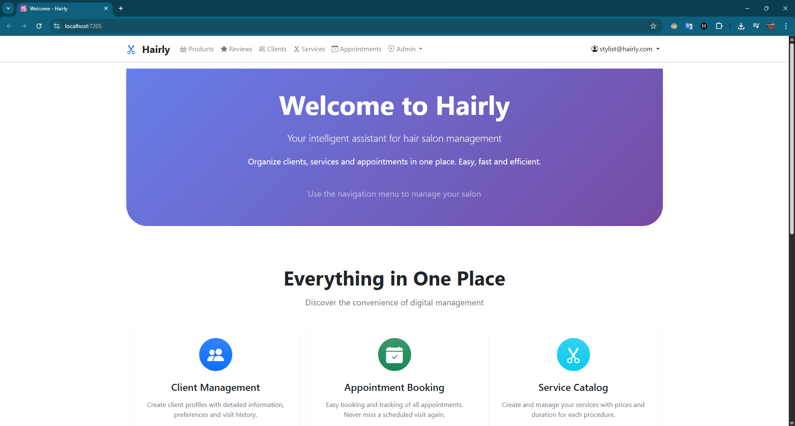
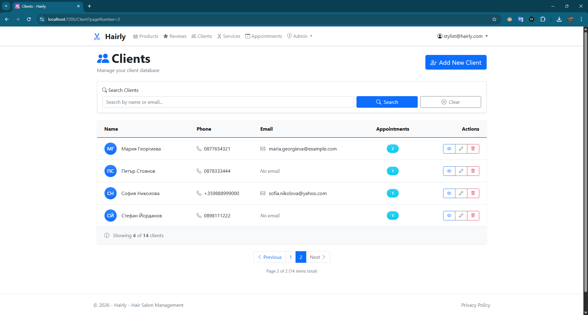
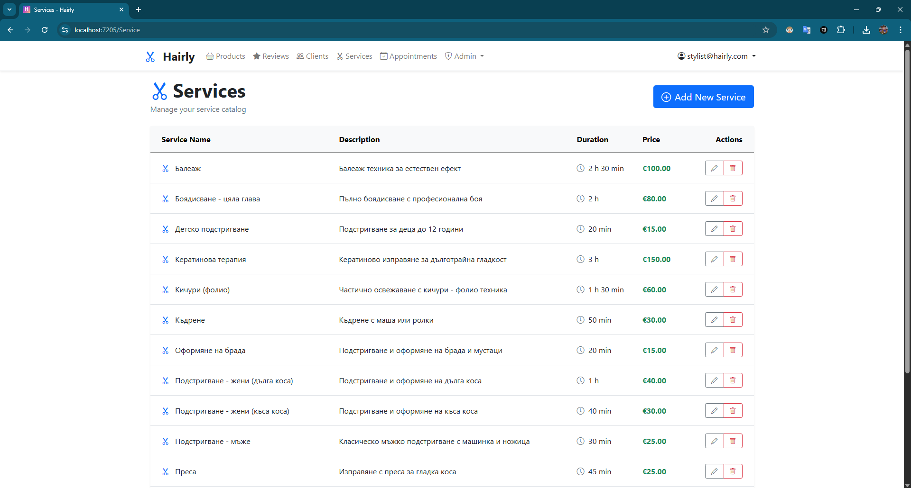
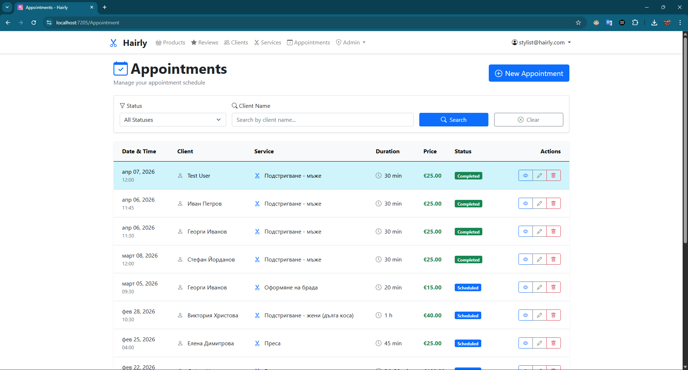
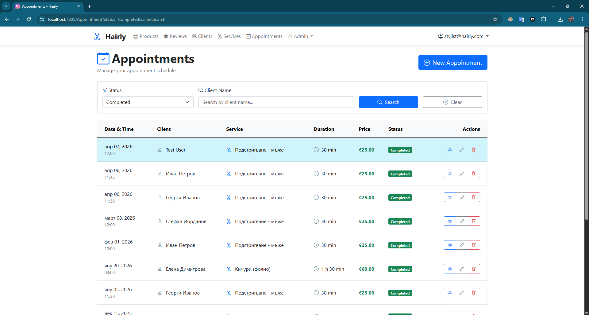
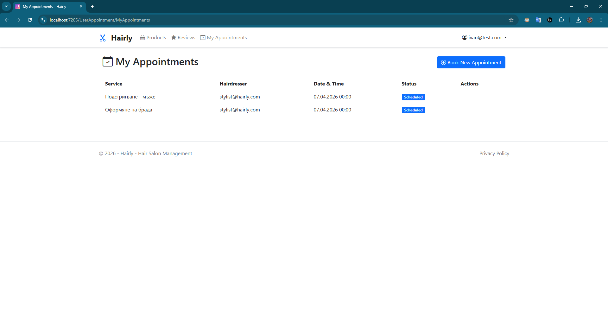
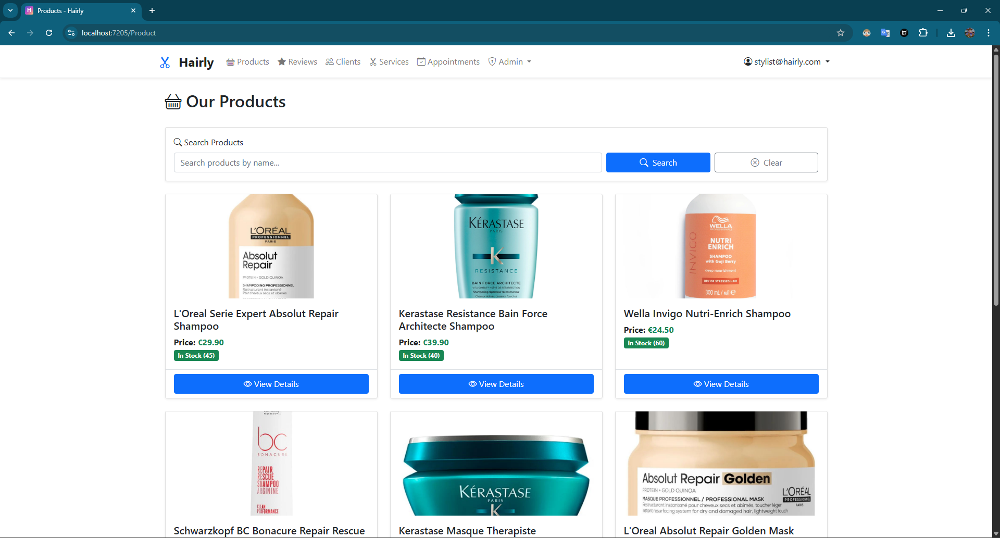
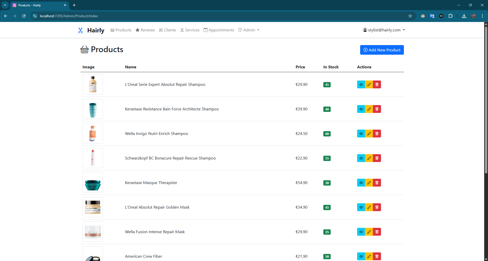
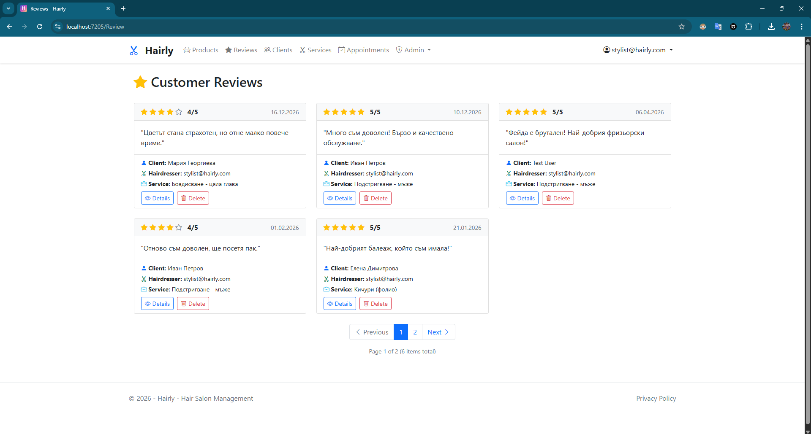

# 💈 Hairly Web App

> A web application for hairdressers to manage clients, services, and appointments


---

## 📋 Table of Contents

- [About the Project](#about-the-project)
- [Features](#features)
- [Screenshots](#screenshots)
- [Technologies Used](#technologies-used)
- [Prerequisites](#prerequisites)
- [Installation & Setup](#installation--setup)
  - [Windows Setup](#windows-setup)
  - [macOS Setup](#macos-setup)
- [Database Configuration](#database-configuration)
- [Running the Application](#running-the-application)
- [Default Login](#default-login)
- [Project Structure](#project-structure)
- [How to Use](#how-to-use)
- [Troubleshooting](#troubleshooting)
- [License](#license)
- [Contact](#contact)

---

## 📖 About the Project

**Hairly** is a comprehensive web application that helps hairdressers manage their business. The system allows you to:
- Keep track of your clients
- Manage your services (haircuts, coloring, etc.)
- Schedule and manage appointments
- Browse and manage product catalog
- Collect and display client reviews
- Enable clients to book their own appointments

This project was built for the **ASP.NET Advanced** course at SoftUni (extended from the Fundamentals course). It demonstrates best practices in ASP.NET Core MVC, Entity Framework, role-based security, and comprehensive unit testing.

---

## ✨ Features

### 👥 Client Management
- ✅ Add, edit, view, and delete clients
- ✅ Store client details (name, phone, email, notes)
- ✅ See appointment history for each client
- ✅ **Pagination** - Browse clients 5 per page
- ✅ **Search & Filter** - Find clients by name, phone, or email

### 💇 Service Catalog
- ✅ Add and manage your services
- ✅ Set prices and duration for each service
- ✅ See how many active appointments use each service
- ✅ **Pagination** - Browse services 5 per page
- ✅ **Search & Filter** - Find services by name or filter by price range

### 📅 Appointment Scheduling
- ✅ Create appointments with client and service
- ✅ Edit appointments and change status
- ✅ Track appointment statuses (Scheduled, Completed, Canceled, Did Not Show)
- ✅ View all appointment details
- ✅ Today's appointments are highlighted
- ✅ **Pagination** - Browse appointments 5 per page
- ✅ **Search & Filter** - Filter by status, date range, client, or service

### 🛒 Product Catalog (Admin)
- ✅ Browse available hair care products
- ✅ View product details, prices, and stock
- ✅ **Admin-only** product management (Create, Edit, Delete)
- ✅ **Pagination** - Browse products 5 per page
- ✅ **Search & Filter** - Find products by name or filter by price

### ⭐ Review System
- ✅ Clients can leave reviews after **completed** appointments
- ✅ 5-star rating with optional comment
- ✅ One review per appointment (prevent duplicates)
- ✅ Public review display on Reviews page
- ✅ Clients can delete their own reviews
- ✅ **Admin** can delete any review
- ✅ **Pagination** - Browse reviews 5 per page
- ✅ **Search & Filter** - Filter by rating or search by client/hairdresser

### 👤 User Appointment Booking
- ✅ Registered users can book their own appointments
- ✅ View "My Appointments" page
- ✅ Auto-create client record on first booking
- ✅ Track appointment status and history

### 🔐 Role-Based Security
- ✅ **Three roles**: User, Hairdresser, Admin
- ✅ **Users** - Book appointments, leave reviews
- ✅ **Hairdressers** - Manage clients, services, appointments
- ✅ **Admin** - Full access + Product/Review management
- ✅ Login required to use the app
- ✅ Each hairdresser sees only their own data
- ✅ Deleted items can be recovered (soft delete)

### 🎨 Advanced UI Features
- ✅ **Custom Error Pages** - 404, 500, and generic error handlers
- ✅ **Responsive Design** - Works on desktop, tablet, and mobile
- ✅ **Bootstrap 5** - Modern, clean interface
- ✅ **Toast Notifications** - Success/error messages
- ✅ **Confirmation Dialogs** - Before deleting records

### 🧪 Testing & Quality
- ✅ **82.3% Code Coverage** - 59 comprehensive unit tests
- ✅ **NUnit** test framework
- ✅ **In-Memory Database** testing
- ✅ Tests for all core services
- ✅ Edge case and validation testing

---

## 📸 Screenshots

### Main Page
> *Screenshot of the home page will go here*



### Client Management
> *Screenshot of the clients list*



### Service Management
> *Screenshot of the services list*



### Appointment Scheduling
> *Screenshot of the appointments page*



### Completed Appointments Only
> *Screenshot of filtered completed appointments*



### User Appointments Page
> *Screenshot of user appointments*



### Products Page
> *Screenshot of the products page*



### Admin Products Page
> *Screenshot of the manage products page*



### Reviews Page
> *Screenshot of the reviews page*



---

## 🛠️ Technologies Used

| Technology | Version | Purpose |
|-----------|---------|---------|
| ASP.NET Core MVC | 8.0 | Web framework |
| Entity Framework Core | 8.0 | Database access |
| SQL Server LocalDB (Windows) | - | Development database |
| SQL Server (Docker on macOS) | - | Development database |
| ASP.NET Identity | 8.0 | User login and security |
| Bootstrap | 5.3 | Responsive design |
| jQuery | 3.7 | Form validation |
| C# | 12.0 | Programming language |

---

## ✅ Prerequisites

### For Windows:

- **[.NET SDK 8.0+](https://dotnet.microsoft.com/download)**
- **[Visual Studio 2022](https://visualstudio.microsoft.com/)** (recommended) or **[Visual Studio Code](https://code.visualstudio.com/)**
- **[SQL Server LocalDB](https://learn.microsoft.com/en-us/sql/database-engine/configure-windows/sql-server-express-localdb)** (comes with Visual Studio)
- **[Git](https://git-scm.com/)** (optional)

### For macOS:

- **[.NET SDK 8.0+](https://dotnet.microsoft.com/download)**
- **[Visual Studio Code](https://code.visualstudio.com/)**
- **[Docker Desktop](https://www.docker.com/products/docker-desktop/)** (for SQL Server)
- **[Git](https://git-scm.com/)** (optional)

### Verify Installation

Check if .NET SDK is installed:
```bash
dotnet --version
# Should show: 8.0.x or higher
```

---

## 🚀 Installation & Setup

### Step 1: Get the Project

**Option A: Using Git**
```bash
git clone https://github.com/DjankoWE/Hairly-Web-App.git
cd Hairly-Web-App
```

**Option B: Download ZIP**
- Download the ZIP file from GitHub
- Extract to your desired folder
- Open terminal/command prompt in that folder

### Step 2: Install Dependencies

```bash
cd Hairly-Web-App
dotnet restore
```

This downloads all required packages.

---

## 🪟 Windows Setup

### 1. Check SQL Server LocalDB

SQL Server LocalDB should already be installed if you have Visual Studio. To verify:

```bash
sqllocaldb info
```

If not installed, download it from [Microsoft's website](https://learn.microsoft.com/en-us/sql/database-engine/configure-windows/sql-server-express-localdb).

### 2. Apply Database Migrations

```bash
cd Hairly.Web
dotnet ef database update
```

✅ This creates the database and adds test data (clients, services, appointments).

### 3. Run the Application

**Option A: Visual Studio**
1. Open `Hairly-Web-App.sln`
2. Press `F5` or click the green play button

**Option B: Command Line**
```bash
cd Hairly.Web
dotnet run
```

The app will open at `https://localhost:7205`

---

## 🍎 macOS Setup

### 1. Install and Start SQL Server with Docker

Since macOS doesn't have SQL Server LocalDB, we'll use Docker:

**Install Docker Desktop:**
- Download from [docker.com](https://www.docker.com/products/docker-desktop/)
- Install and start Docker Desktop

**Start SQL Server container:**
```bash
docker run -e "ACCEPT_EULA=Y" -e "MSSQL_SA_PASSWORD=YourStrong@Password123" \
   -p 1433:1433 --name sqlserver --hostname sqlserver \
   -d mcr.microsoft.com/mssql/server:2022-latest
```

**Verify SQL Server is running:**
```bash
docker ps
# Should show the sqlserver container running
```

### 2. Update Connection String for macOS

Edit `Hairly.Web/appsettings.Development.json`:

**Change from:**
```json
"Server=(localdb)\\mssqllocaldb;Database=HairlyDB;..."
```

**To:**
```json
"Server=localhost,1433;Database=HairlyDB;User Id=sa;Password=YourStrong@Password123;TrustServerCertificate=True;MultipleActiveResultSets=true"
```

### 3. Install EF Core Tools

```bash
dotnet tool install --global dotnet-ef
```

### 4. Apply Database Migrations

```bash
cd Hairly.Web
dotnet ef database update
```

✅ This creates the database and adds test data.

### 5. Run the Application

**Option A: Visual Studio Code**
1. Open the project folder in VS Code
2. Install C# extension if prompted
3. Press `F5` to run

**Option B: Command Line**
```bash
cd Hairly.Web
dotnet run
```

The app will open at `https://localhost:7205`

---

## 🗄️ Database Configuration

The project uses two configuration files:

### appsettings.json (Production)
```json
"Server=.;Database=HairlyDB;Trusted_Connection=True;..."
```
- Used when deploying to a production server
- You don't need to change this for local development

### appsettings.Development.json (Local Development)
```json
"Server=(localdb)\\mssqllocaldb;Database=HairlyDB;..."
```
- **Windows:** Uses SQL Server LocalDB (default)
- **macOS:** Change to Docker SQL Server connection (see macOS setup)

The application automatically uses the Development configuration when running locally.

---

## ▶️ Running the Application

### Using Visual Studio (Windows)
1. Open `Hairly-Web-App.sln`
2. Press `F5` or click the start button
3. App opens in your browser automatically

### Using Visual Studio Code (Windows/macOS)
1. Open the project folder
2. Press `F5`
3. Select ".NET Core Launch" if prompted

### Using Command Line (Windows/macOS)
```bash
cd Hairly.Web
dotnet run
```

Then open your browser and go to:
- HTTPS: `https://localhost:7205`
- HTTP: `http://localhost:5172`

---

## 🔑 Default Login

The database comes with test accounts for each role:

### Admin + Hairdresser Account

| Field | Value |
|-------|-------|
| **Email** | `stylist@hairly.com` |
| **Password** | `Hairly123!` |
| **Roles** | Admin, Hairdresser |

**This account can:**
- ✅ Manage clients, services, appointments
- ✅ Manage products (Admin only)
- ✅ Delete any review (Admin only)
- ✅ Access all hairdresser features

### Secondary Hairdresser Account

| Field | Value |
|-------|-------|
| **Email** | `hairdresser@hairly.com` |
| **Password** | `Hairdresser123!` |
| **Role** | Hairdresser |

### How to Login:

1. Start the application
2. Click **"Login"** in the top-right corner
3. Enter the email and password above
4. Click **"Login"**

You'll see:
- 10 test clients
- 12 services
- 14 appointments
- 11 products (Browse as public, manage as Admin)
- 5 reviews

**You can also create your own account by clicking "Register"** (gets "User" role by default).

---

## 📁 Project Structure

```
Hairly-Web-App/
│
├── Hairly.Web/                          # Main web application
│   ├── Controllers/                     # Public controllers
│   │   ├── ClientController.cs         # Client CRUD (Hairdresser)
│   │   ├── ServiceController.cs        # Service CRUD (Hairdresser)
│   │   ├── AppointmentController.cs    # Appointment CRUD (Hairdresser)
│   │   ├── ProductController.cs        # Product browsing (Public)
│   │   ├── ReviewController.cs         # Review display + Create/Delete
│   │   ├── UserAppointmentController.cs # User booking (Registered Users)
│   │   ├── ErrorController.cs          # Custom error pages
│   │   └── HomeController.cs           # Landing page
│   ├── Areas/Admin/                     # Admin-only features
│   │   └── Controllers/
│   │       └── ProductController.cs    # Product management (Admin)
│   ├── Views/                           # Razor views
│   │   ├── Client/                      # Client pages
│   │   ├── Service/                     # Service pages
│   │   ├── Appointment/                 # Appointment pages
│   │   ├── Product/                     # Product browsing
│   │   ├── Review/                      # Review pages
│   │   ├── UserAppointment/             # User booking
│   │   ├── Error/                       # Error pages (404, 500)
│   │   └── Shared/                      # Layout, partials
│   ├── wwwroot/                         # Static files
│   │   ├── css/                         # Custom styles
│   │   ├── js/                          # JavaScript
│   │   └── images/                      # Product images, logos
│   ├── appsettings.json                 # Production config
│   ├── appsettings.Development.json     # Development config
│   └── Program.cs                       # App startup + middleware
│
├── Hairly.Services.Core/                # Business logic layer
│   ├── AppointmentService.cs           # Appointment operations
│   ├── UserAppointmentService.cs       # User booking logic
│   ├── ClientService.cs                # Client operations
│   ├── ServiceService.cs               # Service operations
│   ├── ProductService.cs               # Product operations
│   ├── ReviewService.cs                # Review operations
│   └── Contracts/                       # Service interfaces
│
├── Hairly.Services.Tests/               # Unit tests (NUnit)
│   ├── AppointmentServiceTests.cs      # 13 tests
│   ├── UserAppointmentServiceTests.cs  # 7 tests
│   ├── ReviewServiceTests.cs           # 16 tests
│   ├── ClientServiceTests.cs           # 10 tests
│   └── ProductServiceTests.cs          # 13 tests
│
├── Hairly.Data/                         # Data access layer
│   ├── ApplicationDbContext.cs         # EF Core DbContext
│   ├── Configurations/                  # Fluent API configs
│   ├── Migrations/                      # Database migrations
│   └── Seeding/                         # Seed data
│       └── IdentitySeeder.cs           # Roles & users
│
├── Hairly.Data.Models/                  # Database entities
│   ├── Client.cs                        # Client entity
│   ├── Service.cs                       # Service entity
│   ├── Appointment.cs                   # Appointment entity
│   ├── Product.cs                       # Product entity
│   ├── Review.cs                        # Review entity
│   └── Enums/
│       └── AppointmentStatus.cs        # Scheduled, Completed, etc.
│
├── Hairly.Web.ViewModels/               # DTOs for views
│   ├── Client/                          # Client ViewModels
│   ├── Service/                         # Service ViewModels
│   ├── Appointment/                     # Appointment ViewModels
│   ├── Product/                         # Product ViewModels
│   ├── Review/                          # Review ViewModels
│   └── UserAppointment/                 # User booking ViewModels
│
└── Hairly.GCommon/                      # Shared constants
    ├── ValidationConstants.cs          # Field length, regex
    ├── ErrorMessages.cs                # Error message strings
    ├── SuccessMessages.cs              # Success message strings
    └── ApplicationConstants.cs         # Role names, defaults
```

---

## 💻 How to Use

### Managing Clients

**View all clients:**
- Click **"Clients"** in the menu

**Add a new client:**
1. Click **"Add New Client"**
2. Fill in: First Name, Last Name, Phone Number
3. (Optional) Add email and notes
4. Click **"Create Client"**

**Edit a client:**
- Click the pencil icon next to a client
- Change the information
- Click **"Save Changes"**

**Delete a client:**
- Click the trash icon
- Confirm deletion

**Search/Filter clients:**
- Use the search box to find by name, phone, or email
- Results update as you type
- Navigate with pagination buttons (5 clients per page)

---

### Managing Services

**Add a new service:**
1. Go to **"Services"**
2. Click **"Add New Service"**
3. Enter: Name (e.g., "Haircut"), Price (e.g., 25.00), Duration (e.g., 30 minutes)
4. (Optional) Add description
5. Click **"Create Service"**

**Search/Filter services:**
- Search by service name
- Filter by price range (Min/Max)
- Browse with pagination (5 services per page)

---

### Scheduling Appointments

**Create an appointment:**
1. Go to **"Appointments"**
2. Click **"New Appointment"**
3. Select a **Client** from the dropdown
4. Select a **Service** from the dropdown
5. Pick **Date and Time**
6. (Optional) Add notes
7. Click **"Create Appointment"**

**Change appointment status:**
1. Click the pencil icon on an appointment
2. Change **Status** to:
   - 🔵 **Scheduled** - Upcoming appointment
   - 🟢 **Completed** - Client came and service done
   - 🔴 **Canceled** - Appointment canceled
   - 🟡 **Did Not Show** - Client didn't come
3. Click **"Save Changes"**

**Search/Filter appointments:**
- Filter by status (Scheduled, Completed, etc.)
- Filter by date range
- Search by client or service name
- Browse with pagination (5 appointments per page)

---

### Browsing Products (Public)

**View products:**
1. Click **"Products"** in the menu
2. Browse available hair care products
3. Click on a product to see full details

**Search/Filter products:**
- Search by product name
- Filter by price range
- Navigate with pagination (5 products per page)

**Managing products (Admin only):**
1. Login as Admin (`stylist@hairly.com`)
2. Go to **Admin → Products**
3. Create, Edit, or Delete products
4. Set stock quantity and upload images

---

### Reviews

**Leaving a review (as User):**
1. Login to your account
2. Go to **"My Appointments"**
3. Find a **Completed** appointment (green status)
4. Click **"Leave Review"**
5. Select rating (1-5 stars)
6. (Optional) Add a comment
7. Click **"Submit Review"**

**Note:** You can only review completed appointments, and only once per appointment!

**Viewing reviews:**
- Click **"Reviews"** in the menu
- See all client reviews with ratings
- Filter by rating or search by name

**Deleting reviews:**
- **Users** can delete their own reviews
- **Admin** can delete any review

---

### User Appointment Booking

**Book your own appointment:**
1. Create an account or login
2. Go to **"Book Appointment"**
3. Select a service
4. Pick date and time
5. (Optional) Add notes
6. Click **"Book Appointment"**

**View your appointments:**
- Go to **"My Appointments"**
- See all your bookings
- Check appointment status
- Leave reviews after completed appointments

---

---

## 🧪 Testing

The project includes **comprehensive unit tests** with **82.3% code coverage**!

### Test Statistics

```
Total Tests:      59 passing ✅
Code Coverage:    82.3% (624/758 lines)
Test Framework:   NUnit 3.x + Moq
Database:         EF Core In-Memory
```

### Services Tested

| Service | Tests | Coverage |
|---------|-------|----------|
| AppointmentService | 13 | 93.4% |
| UserAppointmentService | 7 | 94.8% |
| ReviewService | 16 | 95.4% |
| ClientService | 10 | 92.9% |
| ProductService | 13 | 92.0% |

### Running Tests

**Using Visual Studio:**
1. Open **Test Explorer** (Test → Test Explorer)
2. Click **"Run All Tests"**
3. All 59 tests should pass ✅

**Using Command Line:**
```bash
cd Hairly-Web-App
dotnet test
```

**Check Code Coverage:**
```bash
# Install tools (once)
dotnet tool install -g dotnet-reportgenerator-globaltool

# Run tests with coverage
dotnet test --collect:"XPlat Code Coverage"

# Generate HTML report
reportgenerator -reports:"**/coverage.cobertura.xml" -targetdir:"CoverageReport" -reporttypes:Html

# Open report
start CoverageReport/index.html  # Windows
open CoverageReport/index.html   # macOS
```

### What We Test

✅ **Business Logic**
- Create, Read, Update, Delete operations
- Data validation and edge cases
- Permission checks (user vs admin)
- Soft delete functionality

✅ **Service Integration**
- Client → Appointment relationships
- Appointment → Review links
- User → Client auto-creation
- Service → Hairdresser filtering

✅ **Edge Cases**
- Invalid IDs (return null/false)
- Duplicate prevention (reviews)
- Status validation (completed appointments)
- Permission violations

---

## 🔧 Troubleshooting

### Database Not Found

**Error:** `Cannot find the database 'HairlyDB'`

**Solution:**
```bash
cd Hairly.Web
dotnet ef database update
```

---

### SQL Server Not Running (macOS)

**Error:** `Cannot connect to SQL Server`

**Solution:** Make sure Docker container is running:
```bash
docker ps
# If not running, start it:
docker start sqlserver
```

---

### Port Already in Use

**Error:** `Port 7205 is already in use`

**Solution:** Stop other apps using that port or change the port in `launchSettings.json`

---

### Build Errors

**Error:** Package restore failed

**Solution:**
```bash
dotnet restore --force
dotnet clean
dotnet build
```

---

## 🤝 Contributing

This is an educational project for SoftUni. Feel free to:
1. Fork the repository
2. Create a feature branch
3. Make your changes
4. Submit a pull request

---

## 📄 License

This project is licensed under the MIT License - see the [LICENSE](LICENSE) file for details.

---

## 📧 Contact

**Dzhani Karanachev** – [@DjankoWE](https://github.com/DjankoWE)

Project Link: [https://github.com/DjankoWE/Hairly-Web-App](https://github.com/DjankoWE/Hairly-Web-App)

---

## 🎓 Acknowledgments

- Built for **SoftUni's ASP.NET Advanced** course (extended from Fundamentals)
- Thanks to SoftUni trainers and community
- Bootstrap 5 for the responsive UI design
- Bootstrap Icons for clean iconography
- NUnit for comprehensive unit testing

---

## 📊 Project Statistics

```
Lines of Code:       ~15,000+
Controllers:         8 (7 public + 1 admin)
Services:            6
Unit Tests:          59 (82.3% coverage)
Database Tables:     7 (including Identity)
ViewModels:          40+
Migrations:          15+
Roles:               3 (User, Hairdresser, Admin)
Seed Data:           50+ records
```

---

*Made with ❤️ and lots of ☕ by Djanko*
